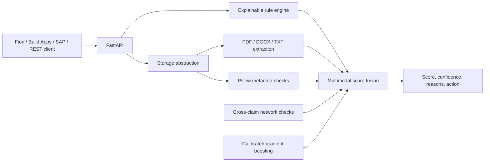

# Fraud Detection Claims API

A production-style FastAPI prototype for explainable car-insurance claim fraud scoring. It combines structured claim rules, uploaded document checks, image metadata, cross-claim file reuse signals, and an optional calibrated histogram gradient-boosting classifier.

The API is designed for SAP Fiori, SAP Build Apps, SAP Integration Suite, SAP S/4HANA extensions, workflow tools, and other REST consumers.

## Architecture



The local storage implementation writes binaries to `storage/uploads` and metadata to `storage/metadata.json`. API responses never expose stored paths. `FileStorageService` and `FileMetadataService` are intentionally separated so production deployments can replace them with SAP Object Store, SAP Document Management Service, and SAP HANA Cloud.

## Local Setup

Python 3.11 or newer is required.

```bash
python -m venv .venv
source .venv/bin/activate
pip install -r requirements.txt
cp .env.example .env
uvicorn app.main:app --reload
```

Open Swagger UI at `http://localhost:8000/docs`. Run tests with:

```bash
pytest
```

Generate fresh deterministic sample data and train the model:

```bash
python -m app.ml.train_model
```

The app works without `app/ml/model.pkl`. When a trained model exists, the final score combines the rule score and calibrated ML fraud probability using `RULE_SCORE_WEIGHT` and `ML_SCORE_WEIGHT`. The default weights are `60%` and `40%`.

## Multimodal LLM Encoder

The optional LLM encoder supports SAP AI Core Orchestration on BTP as the
recommended enterprise provider, with OpenAI as an alternative. It sends
uploaded images and documents to a vision-capable model and validates the
response against a structured schema containing dates, amounts, document
numbers, visual observations, damage severity, description consistency,
suspicious indicators, and an evidence risk score.

The encoder does not make the final fraud decision. Its evidence score receives
a bounded `25%` weight inside the relevant image or document component, while
rules and the calibrated tabular model remain separate. Material
inconsistencies are exposed as explainable `LLM_EVIDENCE_INCONSISTENCY`
findings.

Install dependencies, then configure `.env`:

```bash
pip install -r requirements.txt
```

```dotenv
ENABLE_LLM_ENCODER=true
LLM_PROVIDER=btp
AICORE_RESOURCE_GROUP=grounding-test
ORCH_DEPLOYMENT_URL=https://api.ai.../v2/inference/deployments/your-deployment
AICORE_LLM_MODEL=gpt-4o
MASKING_REQUIRED=true
```

For local development, provide AI Core credentials through
`AICORE_SERVICE_KEY`, or set `AICORE_TOKEN_URL`, `AICORE_CLIENT_ID`, and
`AICORE_CLIENT_SECRET`. On Cloud Foundry, bind the AI Core service instance;
the application discovers credentials from `VCAP_SERVICES`.

SAP Data Privacy Integration pseudonymization is enabled when
`MASKING_REQUIRED=true`, including file-input anonymization. The selected AI
Core model must support image inputs. The embedding deployment is not used by
this semantic extraction pipeline; it can be added later for similarity search
or retrieval.

To use OpenAI instead:

```dotenv
LLM_PROVIDER=openai
OPENAI_API_KEY=your-api-key
LLM_MODEL=gpt-5.5
```

When disabled, missing credentials, or unavailable, the application continues
with local deterministic extraction. Confirm data-processing, retention,
regional, consent, and insurance-governance requirements before using real
customer files.

## Docker

```bash
cp .env.example .env
docker compose up --build
curl http://localhost:8080/health
```

If the build reports `CERTIFICATE_VERIFY_FAILED`, export your organization's
root CA as a PEM-encoded certificate, save it as
`certs/company-root-ca.crt`, and rebuild:

```bash
docker compose build --no-cache
docker compose up
```

Do not work around this error with pip's `--trusted-host`; install the trusted
CA instead so HTTPS certificate verification remains enabled.

The compose volume persists local development uploads. Do not use local container or Cloud Foundry disk as production evidence storage.

## API Flow

1. Submit structured claim data to `/api/v1/claims/score`.
2. Upload documents and damage photos for the claim.
3. Analyze individual files when an immediate preview is needed.
4. Submit the same structured claim to `predict-with-files`.
5. Receive the fraud score, confidence, component scores, reasons, and recommended action.

`predict-with-files` automatically analyzes all files again with claim context, including accident-date image checks.

| Method | Endpoint | Purpose |
|---|---|---|
| GET | `/health` | Readiness and liveness status |
| POST | `/api/v1/claims/score` | Structured claim score |
| POST | `/api/v1/claims/batch-score` | Score up to 100 claims |
| POST | `/api/v1/claims/{claim_id}/files/upload` | Upload one or more files |
| GET | `/api/v1/claims/{claim_id}/files` | List claim file metadata |
| POST | `/api/v1/files/{file_id}/analyze` | Extract and analyze one file |
| POST | `/api/v1/claims/{claim_id}/predict-with-files` | Multimodal prediction |
| POST | `/api/v1/documents/validate` | Validate extracted metadata |
| POST | `/api/v1/model/train` | Train and persist calibrated gradient boosting |
| GET | `/api/v1/model/info` | Model status and metrics |

## Example Calls

Score a claim using the complete example in `bruno/fraud-detection-api/score-claim.bru`:

```bash
curl -X POST http://localhost:8000/api/v1/claims/score \
  -H 'Content-Type: application/json' \
  --data @claim.json
```

Upload evidence:

```bash
curl -X POST http://localhost:8000/api/v1/claims/CLM-10001/files/upload \
  -F document_type=DAMAGE_PHOTO \
  -F files=@front-damage.jpg \
  -F files=@rear-damage.jpg
```

Analyze and predict:

```bash
curl -X POST http://localhost:8000/api/v1/files/FILE-ID/analyze
curl -X POST http://localhost:8000/api/v1/claims/CLM-10001/predict-with-files \
  -H 'Content-Type: application/json' \
  --data @claim.json
```

Example response excerpt:

```json
{
  "claim_id": "CLM-10001",
  "fraud_score": 82.4,
  "risk_level": "VERY_HIGH",
  "recommended_action": "Block payment and investigate",
  "confidence_score": 76.0,
  "structured_claim_score": 70.0,
  "document_score": 90.0,
  "image_score": 85.0,
  "network_score": 80.0,
  "rule_based_score": 81.0,
  "ml_probability_score": 74.0,
  "reasons": [
    {
      "code": "PHOTO_BEFORE_ACCIDENT",
      "message": "One damage photo appears to have been captured before the reported accident date.",
      "severity": "VERY_HIGH"
    }
  ]
}
```

## Predictive Model

The tabular model is a `HistGradientBoostingClassifier` wrapped with
`CalibratedClassifierCV` using sigmoid calibration. It consumes 14 numeric
features derived from claim amounts, dates, history, policy status, garage
history, and missing-evidence indicators. No categorical encoder is needed for
the current feature set.

Training reports accuracy, ROC AUC, and Brier score. Brier score measures
probability calibration, where lower values are better. The bundled sample data
is synthetic and remains suitable only for demonstrating the pipeline.

## Scoring

Structured scoring weights are policyholder history `20%`, claim behavior `20%`, damage and repair consistency `25%`, document validation `20%`, and network risk `15%`.

Multimodal rule scoring weights are structured score `40%`, document score `25%`, image score `20%`, and network score `15%`.

Risk bands and actions:

| Score | Risk | Action |
|---|---|---|
| 0-30 | LOW | Auto-approve |
| 31-60 | MEDIUM | Manual claim handler review |
| 61-80 | HIGH | Special Investigation Unit review |
| 81-100 | VERY_HIGH | Block payment and investigate |

Confidence reflects structured completeness, claim form, damage photos, repair invoice, accident report, high-value police report, successful text extraction, and successful image metadata extraction. A structured-only result includes a reduced-confidence warning.

## File And Analysis Behavior

Supported images are JPEG, PNG, and WebP. Supported documents are PDF, TXT, and DOCX. Uploads use generated filenames, SHA-256 checksums, extension and MIME allowlists, size limits, and content validation. Executables and corrupt files are rejected.

PDF text is extracted with `pypdf`, DOCX with `python-docx`, TXT as UTF-8, and images with Pillow. Extraction finds date, amount, invoice-number, and hashed bank-detail candidates. Image analysis records dimensions, format, EXIF time, low resolution, pre-accident capture, and duplicate hashes across claims.

The deterministic OCR and damage-classification hooks do not fabricate results;
they return `DISABLED`, `NOT_IMPLEMENTED`, or `UNKNOWN` with a reason. The
optional multimodal LLM encoder adds semantic document and image analysis when
configured. Future adapters can also use SAP Document Information Extraction,
Azure Document Intelligence, Google Document AI, Tesseract, SAP AI Core, or a
dedicated vision model.

## Bruno

Open `bruno/fraud-detection-api` in Bruno and select the `local` environment. The collection covers health, structured and batch scores, upload/list/analyze, multimodal prediction, document validation, model training, and model information. Update the upload request's local file path before sending it.

## SAP BTP Cloud Foundry

```bash
cf login
cf push
cf bind-service fraud-detection-claims-api YOUR-AICORE-SERVICE-INSTANCE
cf set-env fraud-detection-claims-api ORCH_DEPLOYMENT_URL "YOUR-ORCHESTRATION-DEPLOYMENT-URL"
cf restage fraud-detection-claims-api
```

`manifest.yml` configures the Python buildpack, `${PORT}`, `/health`, and the
BTP encoder provider. Cloud Foundry local disk is ephemeral and must not hold
production claim evidence. Replace the local storage adapter with SAP Object
Store or SAP Document Management Service and persist metadata in SAP HANA
Cloud. Bind service credentials through BTP service bindings, never source
control.

For enterprise connectivity, use SAP BTP Destination service and SAP Cloud Connector to reach private SAP S/4HANA claims data, SAP FS-CD, or SAP ICM. SAP Integration Suite can orchestrate claim events and map enterprise payloads to this API.

## SAP BTP Kyma

1. Build and push the Docker image to an accessible registry.
2. Replace `<your-registry>` in `k8s/deployment.yaml`.
3. Configure production storage bindings and secrets.
4. Deploy:

```bash
kubectl apply -f k8s/deployment.yaml
kubectl apply -f k8s/service.yaml
```

Expose the service with the Kyma API Gateway or an ingress resource appropriate to the cluster. The supplied probes use `/health`.

## Production Notes And Limitations

- Local JSON metadata is suitable for a prototype, not concurrent multi-instance production use.
- Hash reuse is a useful signal but does not prove fraud.
- Text extraction is not OCR; scanned documents may yield no text.
- EXIF timestamps can be absent or manipulated.
- The included model uses synthetic data and must be retrained on governed, representative, bias-reviewed insurance outcomes.
- Add authentication and authorization using SAP Authorization and Trust Management service before exposing claim data.
- Add malware scanning, encryption, retention policies, audit logging, observability, and human-review feedback loops.
- For multi-instance deployment, use SAP HANA Cloud for metadata and network features, object storage for binaries, and a queue or workflow for heavier extraction.

Future enhancements include graph analytics for shared identities and garages,
embedding-based evidence similarity, drift monitoring, OCR adapters, real
damage segmentation, and Fiori or SAP Build Apps review screens.
