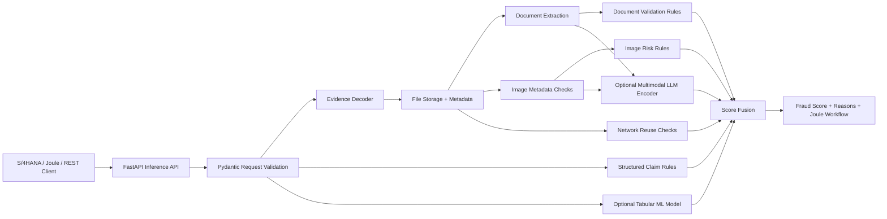
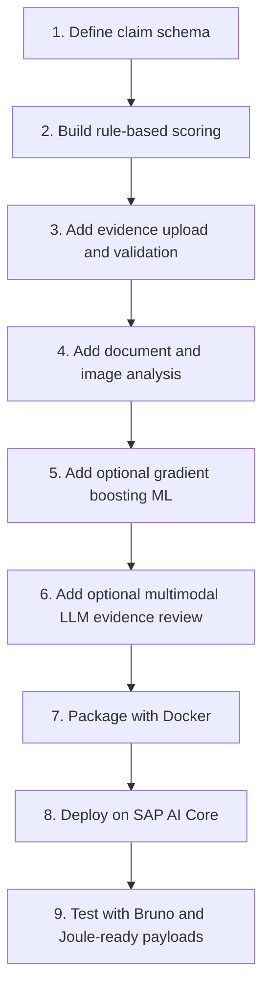
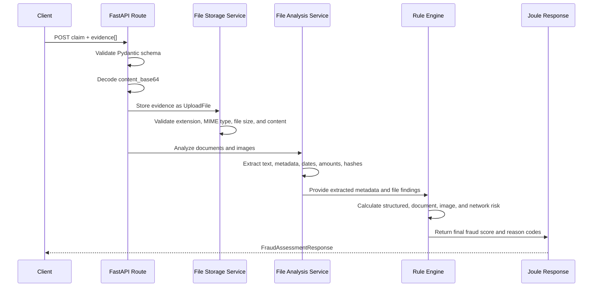
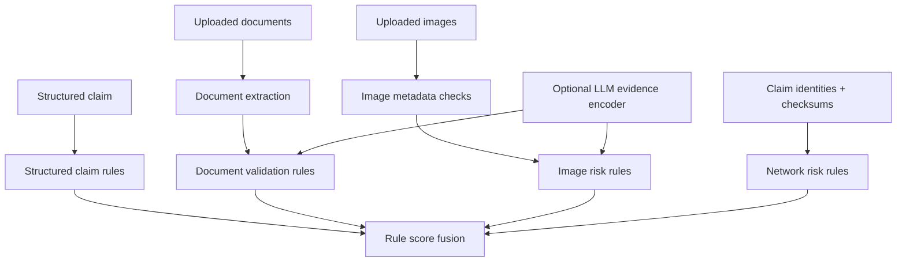
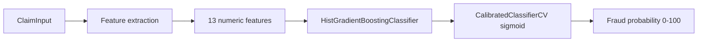
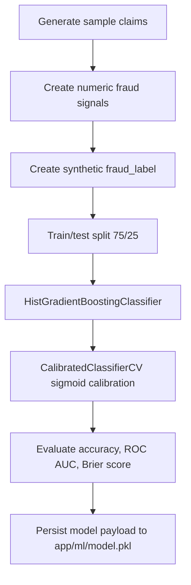
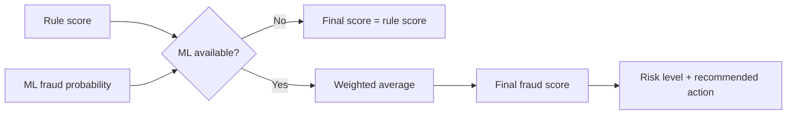
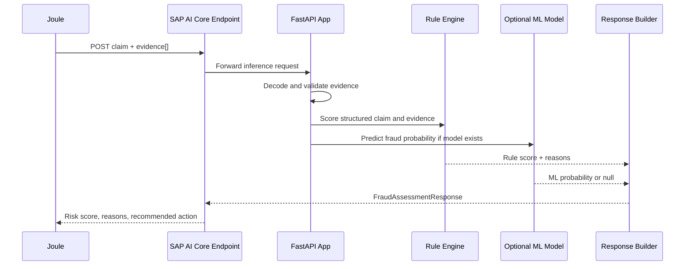
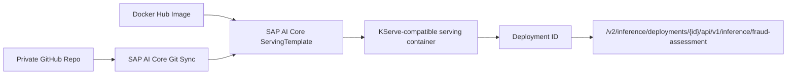

# Fraud Detection Claims Project - Development and Scoring Explanation

## 1. Purpose of the Project

The Fraud Detection Claims project is a technical prototype for motor insurance claim fraud assessment. It exposes a FastAPI service that receives structured claim details and evidence files, then returns an explainable fraud assessment for claims handlers, Joule, or another downstream workflow.

The main goal is not to automatically reject claims. The goal is to help claims teams triage cases faster by producing:

- a final `fraud_score`
- a `risk_level`
- a `recommended_action`
- explainable reason codes
- evidence used in the assessment
- component scores for structured claim, documents, images, network risk, rules, and optional ML
- a Joule-friendly workflow response

The solution combines three intelligence layers:

1. Rule-based fraud scoring
2. Optional tabular ML scoring using calibrated gradient boosting
3. Optional multimodal evidence analysis through an LLM provider such as SAP AI Core / BTP

## 2. High-Level Architecture



### Main Runtime Components

| Layer | Main Files | Responsibility |
|---|---|---|
| API | `app/api/routes_inference.py`, `app/api/routes_claims.py` | Exposes scoring and inference endpoints |
| Data models | `app/models/*.py` | Validates claim, evidence, scoring, and response schemas |
| File handling | `app/services/file_storage_service.py`, `app/services/file_metadata_service.py` | Stores uploaded evidence and metadata |
| Document extraction | `app/services/document_extraction_service.py` | Extracts text, dates, amounts, invoice numbers, and bank hashes |
| Image analysis | `app/services/image_analysis_service.py` | Checks image metadata, duplicates, dimensions, and dates |
| Rule scoring | `app/core/scoring.py`, `app/services/document_validation_service.py`, `app/services/network_risk_service.py` | Calculates explainable fraud risk components |
| ML model | `app/services/model_service.py`, `app/ml/train_model.py` | Trains and serves optional calibrated gradient boosting predictions |
| Score fusion | `app/services/score_fusion_service.py`, `app/services/multimodal_fraud_service.py` | Combines rules, evidence, network, and optional ML |
| SAP deployment | `ai-core/templates/fraud-assessment-api.yaml`, `Dockerfile` | Runs the API as an SAP AI Core serving workload |

## 3. Development Flow

The project was developed in incremental layers so that the application remains useful even when optional AI or ML layers are unavailable.



### Development Principles

- The rule engine always works, even without a trained ML model.
- The ML model is optional and only contributes when `app/ml/model.pkl` exists.
- The multimodal LLM layer is optional and only contributes when configured.
- Every score includes explanations and reason codes.
- Evidence is validated before scoring to avoid trusting corrupted or mismatched files.
- The final API response is structured for both technical clients and business workflows.

## 4. API Contract

The SAP AI Core / Joule inference endpoint is:

```text
POST /api/v1/inference/fraud-assessment
```

The request has two main sections:

```json
{
  "claim": {},
  "evidence": [],
  "replace_existing_evidence": true
}
```

### `claim`

The `claim` section contains structured motor insurance claim data:

- claim ID
- policy ID
- policyholder ID
- claim amount
- vehicle value
- repair estimate
- accident date
- claim report date
- policy start and end dates
- coverage type
- driver age
- vehicle age and mileage
- previous claim history
- premium status
- policy changes
- garage history
- declared evidence availability
- optional hashed identifiers such as bank, phone, and email

### `evidence`

The `evidence` section is a list of documents and images. Each item has:

| Field | Meaning |
|---|---|
| `filename` | Original file name, including extension |
| `content_type` | Technical MIME type, for example `image/png`, `application/pdf`, `text/plain` |
| `document_type` | Business evidence category, for example `DAMAGE_PHOTO`, `POLICE_REPORT`, `REPAIR_INVOICE` |
| `content_base64` | Base64 encoded raw file content |

Supported `document_type` values include:

- `DAMAGE_PHOTO`
- `REPAIR_INVOICE`
- `POLICE_REPORT`
- `ACCIDENT_REPORT`
- `CLAIM_FORM`
- `DRIVER_LICENSE`
- `VEHICLE_REGISTRATION`
- `WITNESS_STATEMENT`
- `OTHER`

The API accepts mixed document and image evidence in one payload.

## 5. Evidence Processing Flow



### File Validation

The file storage layer checks:

- file is not empty
- file is below max upload size
- extension is allowed
- MIME type is allowed
- MIME type matches the extension
- file content is valid for that extension

Examples:

- `.txt` must be `text/plain` and UTF-8 readable
- `.pdf` must be `application/pdf` and start with valid PDF content
- `.docx` must be a valid DOCX archive
- image files must be readable by Pillow

This prevents a caller from sending a file named `invoice.pdf` with a mismatched MIME type or corrupted content.

## 6. Rule-Based Scoring

The rule-based layer is the baseline scoring engine. It does not need training data. It uses business logic and deterministic checks to identify suspicious claim patterns.

There are two rule levels:

1. Structured claim rules
2. Multimodal evidence and network rules

### 6.1 Structured Claim Rules

Structured rules are implemented in `app/core/scoring.py`.

They calculate five component scores:

| Component | Weight | Examples of risk signals |
|---|---:|---|
| Policyholder history | 20% | New policy claim, multiple previous claims, rejected claims, premium overdue |
| Claim behavior | 20% | Delayed reporting, claim amount near approval threshold, unusual accident hour |
| Damage and repair consistency | 25% | High repair estimate, suspicious garage, no damage photos, vague damage |
| Document validation | 20% | Missing police report, invoice before accident, photo before accident |
| Network risk | 15% | Garage risk or reused identifiers |

The structured score is calculated as:

```text
structured_score =
  0.20 * policyholder_history
+ 0.20 * claim_behavior
+ 0.25 * damage_repair_consistency
+ 0.20 * document_validation
+ 0.15 * network_risk
```

### 6.2 Rule Examples

| Rule code | Trigger | Risk meaning |
|---|---|---|
| `NEW_POLICY_CLAIM` | Accident occurs within 30 days of policy start | Claim soon after policy activation |
| `MULTIPLE_PREVIOUS_CLAIMS` | Policyholder has 3 or more previous claims | Repeated claims behavior |
| `PREVIOUS_REJECTED_CLAIMS` | Previous rejected claims exist | Prior suspicious or invalid claims |
| `PREMIUM_NOT_CURRENT` | Premium status is not `PAID` or `CURRENT` | Policy/payment concern |
| `DELAYED_REPORTING` | Claim is reported more than 7 days after accident | Reporting delay |
| `CLAIM_VALUE_RATIO_HIGH` | Claim amount is more than 70% of vehicle value | Disproportionate claim |
| `CLAIM_NEAR_APPROVAL_THRESHOLD` | Amount is close to configured approval thresholds | Possible threshold gaming |
| `UNUSUAL_ACCIDENT_TIME` | Accident hour between 00:00 and 05:00 | Unusual incident time |
| `REPAIR_ESTIMATE_TOO_HIGH` | Repair estimate is more than 65% of vehicle value | Repair amount concern |
| `SUSPICIOUS_GARAGE_HISTORY` | Garage has prior suspicious claims | Supplier/network concern |
| `NO_DAMAGE_PHOTOS` | No damage photos declared | Missing visual evidence |
| `NO_REPAIR_INVOICE` | No repair invoice declared | Missing repair proof |
| `PHOTO_BEFORE_ACCIDENT` | Photo date is before accident date | Evidence timing inconsistency |
| `INVOICE_BEFORE_ACCIDENT` | Invoice date is before accident date | Document timing inconsistency |

Each triggered rule adds points to its component and creates a `RiskReason` with:

- `code`
- `message`
- `severity`
- internal `points`
- internal `component`

Only the customer-facing fields are returned in the API response.

## 7. Evidence and Multimodal Rule Scoring

When evidence files are available, `MultimodalFraudService` runs a broader scoring pipeline.



The multimodal rule score is calculated as:

```text
rule_score =
  0.40 * structured_score
+ 0.25 * document_score
+ 0.20 * image_score
+ 0.15 * network_score
```

### Document Score

Document validation is implemented in `app/services/document_validation_service.py`.

The system checks:

- required document types
- police report requirement for high-value claims
- invoice date compared to accident date
- photo date compared to accident date
- police report date consistency
- invoice amount compared to claim amount
- invoice amount compared to vehicle value
- duplicate document checksums
- invoice reused across claims
- bank details reused across claims

Required baseline documents are:

- `CLAIM_FORM`
- `DAMAGE_PHOTO`
- `REPAIR_INVOICE`
- `DRIVER_LICENSE`
- `VEHICLE_REGISTRATION`

For high-value claims, `POLICE_REPORT` is also expected.

### Image Score

Image scoring checks:

- missing damage photos
- too few photos for high-value claims
- low-resolution image findings
- photo captured before the accident date
- duplicate image across claims
- failed file analysis
- optional multimodal inconsistency findings
- optional cross-image vehicle consistency findings

If at least two damage images are uploaded, the optional multimodal layer can compare whether the images appear to show the same vehicle.

### Network Score

Network scoring checks whether data or evidence is reused across different claims:

- reused bank account hash
- reused phone hash
- reused email hash
- reused file checksum
- suspicious garage network history

These checks are useful because fraud often appears as repeated patterns rather than a single suspicious field.

## 8. Optional ML Model

The ML model is implemented in:

- `app/services/model_service.py`
- `app/ml/train_model.py`

The model is optional. If no trained model exists at `app/ml/model.pkl`, the system still works and uses the rule score only.



### ML Feature List

The model uses numeric features derived from the structured claim:

| Feature | Meaning |
|---|---|
| `claim_vehicle_ratio` | Claim amount divided by vehicle value |
| `repair_vehicle_ratio` | Repair estimate divided by vehicle value |
| `days_since_policy_start` | Days between policy start and accident |
| `report_delay_days` | Days between accident and claim report |
| `previous_claims` | Number of previous claims |
| `previous_rejected_claims` | Number of previous rejected claims |
| `premium_overdue` | 1 when premium is not paid/current |
| `recent_policy_change` | 1 when policy was recently changed |
| `unusual_accident_hour` | 1 when accident occurred between 00:00 and 05:00 |
| `garage_suspicious_claims` | Number of suspicious historical garage claims |
| `missing_police_report` | 1 when police report is missing |
| `missing_damage_photos` | 1 when damage photos are missing |
| `missing_repair_invoice` | 1 when repair invoice is missing |

### Training Process

The training script creates deterministic synthetic sample data for demonstration. It then trains a calibrated gradient boosting classifier.



The base model is:

```text
HistGradientBoostingClassifier
```

with:

- learning rate `0.06`
- max iterations `200`
- max leaf nodes `15`
- min samples per leaf `10`
- L2 regularization `1.0`
- balanced class weighting
- random state `42`

The classifier is wrapped with:

```text
CalibratedClassifierCV(method="sigmoid", cv=3)
```

Calibration is important because the system needs a probability-like fraud score, not only a class label. The model returns a probability of fraud from 0 to 1, and the API converts it to a 0 to 100 score.

### ML Metrics

Training reports:

| Metric | Meaning |
|---|---|
| Accuracy | How often the predicted class matches the synthetic label |
| ROC AUC | How well the model ranks fraud vs non-fraud cases |
| Brier score | How well calibrated the predicted probabilities are |

Lower Brier score is better.

## 9. Final Score Fusion

The final score combines the rule score and optional ML probability.



If ML is not available:

```text
final_score = rule_score
```

If ML is available, the default configuration is:

```text
final_score =
  (0.60 * rule_score + 0.40 * ml_probability_score)
  / (0.60 + 0.40)
```

The weights are configurable:

- `RULE_SCORE_WEIGHT`
- `ML_SCORE_WEIGHT`

The current default is:

- rule score: `60%`
- ML score: `40%`

This design keeps rules as the primary decision explanation while allowing the trained model to adjust the final risk score when available.

## 10. Risk Levels and Actions

The final fraud score is converted into risk bands:

| Score range | Risk level | Recommended action |
|---:|---|---|
| 0-30 | `LOW` | Auto-approve |
| 31-60 | `MEDIUM` | Manual claim handler review |
| 61-80 | `HIGH` | Special Investigation Unit review |
| 81-100 | `VERY_HIGH` | Block payment and investigate |

The recommended action is returned directly in the API response.

## 11. Confidence Score

The confidence score is separate from the fraud score.

Fraud score answers:

```text
How suspicious is this claim?
```

Confidence score answers:

```text
How complete and reliable is the available evidence?
```

Confidence starts with a base value and increases based on:

- required evidence completeness
- successful text extraction
- successful image metadata extraction
- successful optional LLM encoding

Confidence is reduced when expected evidence is missing.

## 12. Example End-to-End Flow



## 13. Why Both Rules and ML Are Used

The system intentionally uses both rule-based logic and ML.

### Rule-based layer

Strengths:

- transparent and explainable
- works without training data
- easy to map to business policies
- produces reason codes for claims handlers
- predictable behavior for regulatory review

Limitations:

- may miss subtle fraud patterns
- depends on manually designed thresholds
- can be rigid if fraud behavior changes

### ML layer

Strengths:

- learns weighted combinations of risk signals
- can detect nonlinear interactions between fields
- outputs a calibrated fraud probability
- can improve as governed historical data becomes available

Limitations:

- needs representative training data
- requires monitoring for drift and bias
- is harder to explain than explicit rules
- should not be used alone for claim rejection

### Combined approach

The hybrid design gives the best operational balance:

- rules provide governance and explanations
- ML provides probability adjustment and pattern sensitivity
- the final response remains understandable to business users

## 14. SAP AI Core Deployment

The API is packaged as a Docker image and deployed as an SAP AI Core serving workload.



The serving template runs:

- container name: `kserve-container`
- container port: `8080`
- protocol: `TCP`
- image: `docker.io/itsmarlo/fraud-detection-claims-api:v1`

The AI Core endpoint wraps the internal FastAPI path:

```text
/api/v1/inference/fraud-assessment
```

inside the SAP AI Core inference path:

```text
/v2/inference/deployments/{deploymentId}/api/v1/inference/fraud-assessment
```

## 15. Current Limitations and Production Considerations

The current project is a prototype and should be hardened before production use.

Important production topics:

- replace local file storage with SAP Object Store or SAP Document Management Service
- persist metadata in SAP HANA Cloud instead of local JSON
- add application authentication and authorization
- add malware scanning for uploaded files
- add encryption and retention policies
- add audit logging and observability
- retrain the ML model on governed real claims data
- validate model fairness and bias
- monitor model drift
- add human feedback loops from claims handlers
- confirm data privacy, consent, and regional processing requirements

## 16. Summary

The project was developed as a layered, explainable fraud assessment API:

1. FastAPI receives claim and evidence data.
2. Pydantic validates the structured request.
3. Evidence is decoded, validated, stored, and analyzed.
4. Rule-based scoring creates transparent fraud reasons.
5. Document, image, and network checks extend the risk view.
6. Optional gradient boosting adds calibrated ML probability.
7. Optional multimodal LLM analysis enriches document and image understanding.
8. Score fusion creates the final fraud score.
9. The response is formatted for Joule and claims handler workflows.

The most important design choice is that ML is optional and additive. The rule engine remains the explainable foundation, while ML and multimodal AI improve the assessment when available.
